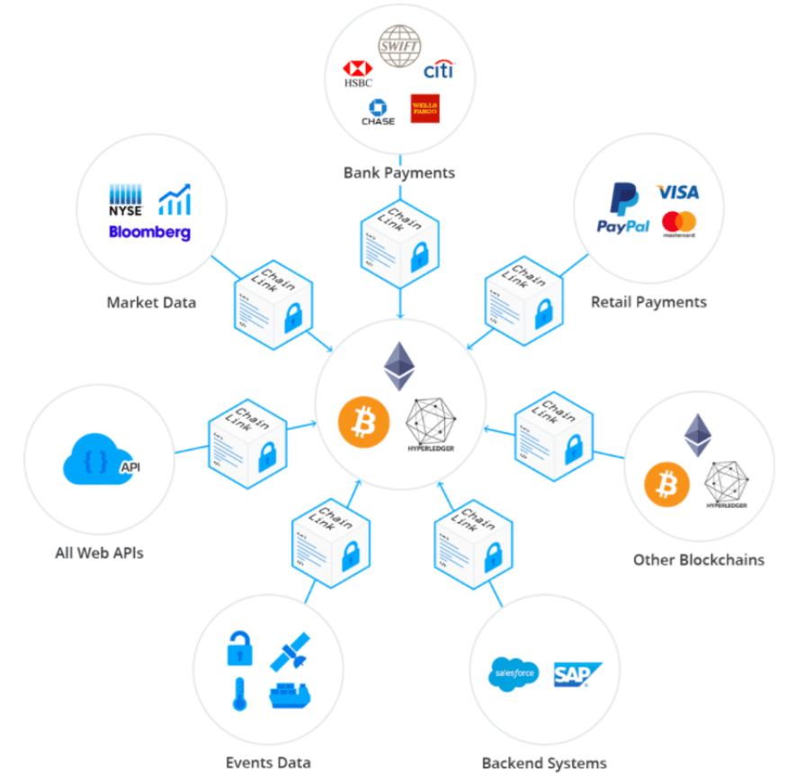

# Case-Study--Assignment-One

Case Study: Chainlink 
* What is the name of the company?

Chainlink

* When was the company incorporated?

January 1, 2014 [[1]](https://www.crunchbase.com/organization/chainlink)

* Who are the founders of the company?

Sergey Nazarov, Co-founder and CEO

Steve Ellis, Co-founder and CTO [[2]](https://craft.co/chainlink/executives)

* How did the idea for the company (or project) come about?

Developers recognized the limitations of blockchains inability to "see", or be aware of events that happened off the chain.

* How is the company funded? How much funding have they received?

Chainlink receieved their initial funding through an ICO (initial coin offering) on September 18th, 2017. An ICO is a common way for crypto currency projects to raise funding. In this case, it was done by using a smart contract on the Ethereum network. Speculators would deposit Ethereum (ETH) into the contract, then the contract would give them  Chainlink Tokens (LINK) in return. The ETH deposited into the contract went to the team to fund the development of the project. Chainlink launched with 1 billion tokens, and offered up 35% of them in the initial sale at a price of 2600 link for 1 Ethereum. They raised 32 million dollars in the ICO, working out to a launch price of \$0.091 cents per token, although the stated launch price was \$0.11 per token. This discrepancy could be due to the 20% bonus tokens that were offered to speculators who bought during the presale. [[3]](https://icodrops.com/chainlink/)

* What specific financial problem is the company or project trying to solve?
Chainlink has been endevouring to solve the "oracle problem"--the problem that blockchains, and the smart contracts built on top of them, are natively blind to events that happen off-chain. This is an issue because unless a secure way to connect contracts to offchain events is created, smart contracts themselves will never be able to realize their full potential as a new disruptive innovaion. 

The problem goes beyond the necesity to connect these contracts to offchain data feeds however. In practice it becomes clear that the security of such systems is paramount, especially when money is involved. Because of the natural security properties of blockchains, smart contracts themselves are immutable and tamperproof. They will exist and execute exactly as they are written. A bad actor who is attempting to sabatouge such a contract would be unsuccessful, so they may then turn and attack the next weak link in the system, the oracle feeding the contract data. 
Unless the oracles connected to the smart contract are as secure and robust as the smart contracts itself, the whole point of using a blockchain to execute secure tamperproof smart contracts is rendered pointless. A bad actor can merely gain control the data feed and thus control the outcome of the smart contracts execution.
This is the true nature of the so called "oracle problem". Solving it unlocks real word utility to smart contracts and opens doors to an incredibly vast potential. 
* Who is the company's intended customer?  Is there any information about the market size of this set of customers?
There are many intended customers for Chainlink's oracle network. They range from companies building on blockchains to create decentralized finance (defi) products, to insurance companies, mortgage companies, even brokers and investment bankers on wallstreet. 
* What solution does this company offer that their competitors do not or cannot offer? (What is the unfair advantage they utilize?)
Chainlink has a vast technological moat around them. Their solution to the oracle problem is one of decentralization, and they have a first mover advantage in pioneering this approach to the oracle problem. Other advantages they possess are capital and talent. As of this writing, chainlink is the 24th most valuable crypto currency by marketcap, worth approxamatiely 3 billion dollars. They also boast a 
* Which technologies are they currently using, and how are they implementing them? (This may take a little bit of sleuthing–– you may want to search the company’s engineering blog or use sites like StackShare to find this information.)
Chainlink uses a network of decentralized oracles to reliably transfer data into smart contracts. For example, a lending smart contract may need access to the price of Bitcoin in order to determine liquidation thresholds for their users. Chainlink will access multiple sources of bitcoin price data, pulling it from many different exchanges and websites in real time. It then aggregates that data into an average price on chain, and feeds that average to the lending contract. Pulling from multiple sources ensures that if one API is attacked or is malfunctioning, the smart contract will still have an accurate feed to the price of data and not liquidate positions that it shouldn't. Insecure oracles are a prime target for exploits in the world of defi, and when there is limited access to insurance to protect users from such attacks, the stakes are often very high. 

Landscape
Chainlink operates in the world of blockchains and smart contracts. It is effectively placing itself to be the sinew that stiches the on-chain world and the off-chain world together. It is core infrastructure, as vital to defi as any railroad or freeway is to our modern ways of life, and it is blockchain-agnostic[source], meaning it works on Ethereum, on Binance Smart Chain, on Avalanche, and many others. Therefore whatever L1 becomes the dominant smart contract platform, Chainlink will be well positioned to be useful to it. Though the outlook for it is strong, its success still rests upon a few critical assumptions:
Smart contracts will be adopted for a wide range of financial products in the future.
Decentralized oracles will be the optimal way to feed these contracts the data that they need.
Another competitor will not supplant Chainlink as the defacto oracle provider. 

[1] https://www.crunchbase.com/organization/chainlink
[2] https://craft.co/chainlink/executives
[3] https://icodrops.com/chainlink/

https://icodrops.com/chainlink/

https://blog.chain.link/chainlinks-blockchain-agnostic-design/
