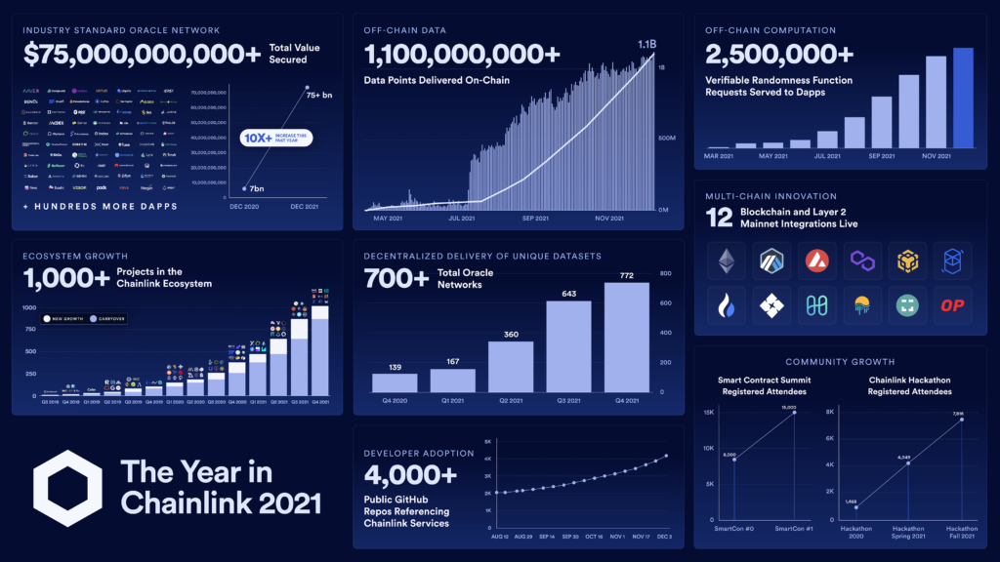

# Case-Study--Assignment-One

## Overview

Case Study: Chainlink 
* What is the name of the company?

Chainlink

* When was the company incorporated?

January 1, 2014 [[1]](https://www.crunchbase.com/organization/chainlink)

* Who are the founders of the company?

Sergey Nazarov, Co-founder and CEO

Steve Ellis, Co-founder and CTO [[2]](https://craft.co/chainlink/executives)

* How did the idea for the company (or project) come about?

Developers recognized the limitations of blockchains' inability to "see", or be aware of events that happened off the chain.

## Business Activities

Chainlink received their initial funding through an ICO (initial coin offering) on September 18th, 2017. An ICO is a common way for cryptocurrency projects to raise funding. In this case, it was done by using a smart contract on the Ethereum network. Speculators would deposit Ethereum (ETH) into the contract, then the contract would give them  Chainlink Tokens (LINK) in return. The ETH deposited into the contract went to the team to fund the development of the project. Chainlink launched with 1 billion tokens and offered up 35% of them in the initial sale at a price of 2600 LINK for 1 ETH. They raised 32 million dollars in the ICO, working out to a launch price of \$0.091 cents per token, although the stated launch price was \$0.11 per token. This discrepancy could be due to the 20% bonus tokens that were offered to speculators who bought during the presale. [[3]](https://icodrops.com/chainlink/)

Chainlink has been endeavouring to solve the "oracle problem"--the problem that blockchains, and the smart contracts built on top of them are natively blind to events that happen off-chain. This is an issue because unless a secure way to connect contracts to off-chain events is created, smart contracts themselves will never be able to realize their full potential as a new disruptive innovation. 

The problem goes beyond the necessity to connect these contracts to off-chain data feeds, however. In practice, it becomes clear that the security of such systems is paramount, especially when money is involved. Because of the natural security properties of blockchains, smart contracts themselves are immutable and tamperproof. They will exist and execute exactly as they are written. A bad actor who is attempting to sabotage such a contract would be unsuccessful, so they may then turn and attack the next weak link in the system, the oracle feeding the contract data. 
Unless the oracles connected to the smart contract are as secure and robust as the smart contracts itself, the whole point of using a blockchain to execute secure tamperproof smart contracts is rendered pointless. A bad actor can merely gain control of the data feed and thus control the outcome of the smart contract's execution.
This is the true nature of the so-called "oracle problem". Solving the oracle problem unlocks real world utility for smart contracts and opens the doors to a boundless potential market. 

There are many intended customers for Chainlink's oracle network. They range from companies building on blockchains to create decentralized finance (defi) products, to insurance companies, mortgage companies, even brokers and investment bankers on Wall Street. 

Chainlink has a vast technological moat around them. Their solution to the oracle problem is one of decentralization, and they have a first mover advantage in pioneering this approach. Other advantages they possess are capital and talent. As of this writing, Chainlink is the 24th most valuable cryptocurrency by market cap, worth approxamatiely 3 billion dollars. They also boast an estimated staff of 350 people[[4]](https://craft.co/chainlink), including former Google CEO Eric Schmidt[[5]](https://chain.link/team), serving in an advisor role.

Chainlink uses a network of decentralized oracles to reliably transfer data into smart contracts. It exists as middleware, between blockchains and the real world data feeds they wish to connect.  For example, a lending smart contract may need access to the price of Bitcoin in order to determine liquidation thresholds for their users. Chainlink will access multiple sources of bitcoin price data, pulling it from many exchanges and websites in real time. It then aggregates that data into an average price on chain, and feeds that average to the lending contract. Pulling from multiple sources ensures that if one API is attacked or is malfunctioning, the smart contract will still have an accurate feed to the price of data and not liquidate positions that it shouldn't. Insecure oracles are a prime target for exploits in the world of defi, and when there is limited access to insurance to protect users from such attacks, the stakes are often very high. 

[[4]](Images/Chainlink.png)

## Landscape

Chainlink operates in the world of blockchains and smart contracts. It is effectively placing itself to be the sinew that stitches the on-chain world and the off-chain world together. It is core infrastructure, as vital to defi as any railroad or freeway is to our modern ways of life, and it is blockchain-agnostic[[5]](https://blog.chain.link/chainlinks-blockchain-agnostic-design/), meaning it works on Ethereum, on Binance Smart Chain, on Avalanche, and many others. Therefore, whatever L1 becomes the dominant smart contract platform, Chainlink will be well positioned to be useful to it. Though the outlook for it is strong, its success still rests upon a few critical assumptions:
* Smart contracts will be adopted for a wide range of financial products in the future.
* Decentralized oracles will be the optimal way to feed these contracts the data that they need.
* Another competitor will not overtake Chainlink as the de facto oracle provider. 

## Results

Chainlink was founded  on January 1st, 2014, launched its ICO on September 14th, 2017, and went live on its mainnet on May, 30th, 2019 [[6]](https://blog.chain.link/three-years-on-mainnet/). Since going live, it has been used by numerous defi protocols and allowed them to provide more secure services to their users. Defi growth has exploded in the last few years and many of the leading protocols could not function in their capacity without a data provider like Chainlink. There is little doubt that a portion of the rapid growth of defi is directly attributable to the development of Chainlink. 

[[7]](Images/ChainlinkResults.png)

## Closing Thoughts

Chainlink, right now, is used primarily to connect defi protocols to their appropriate data feeds. In order for them to continue to grow, a few things need to happen. Though I am far from qualified to offer them advise, what I would hope they will do is continue to try and build inroads to legacy financial systems that operate off-chain and currently use centralized servers to provide their services. Defi needs to onboard these legacy systems and I would encourage the Chainlink team to continue and try and sell the old guard on the new idea of smart contracts. 

Maybe one day the NYSE will be operating on an L1. Maybe one day our paychecks will be automatically deposited into our bank accounts via smart contract. Maybe one day government aid will be dispersed using blockchain and stablecoins. If this future is ever going to be realized, one thing is certain: all of those services will need some sort of oracle data provider, and right now Chainlink remains perhaps the strongest choice in that field. 

[1] https://www.crunchbase.com/organization/chainlink

[2] https://craft.co/chainlink/executives

[3] https://icodrops.com/chainlink/

[4] https://craft.co/chainlink

[5] https://chain.link/team

[6] https://file.publish.vn/amberblocks/2021-09/chainlink-1-1631632136702.png

[7] https://blog.chain.link/chainlinks-blockchain-agnostic-design/

[8] https://blog.chain.link/three-years-on-mainnet/

[9] https://blog.chain.link/wp-content/uploads/2021/12/The-Year-in-Chainlink-2021-Infographic-1024x576.png
